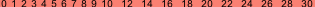
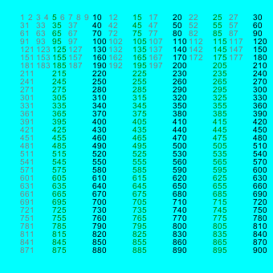

# LuxorLabels
An add-on to [Luxor.jl](https://github.com/JuliaGraphics/Luxor.jl), this only exports `labels_prominent`, which displays the labels which fit in the current Luxor context without overlap.

Selective labels display is nice for rulers, axes and geographical maps that are made for different output scales. There is no use in displaying unreadable labels.

Example of a ruler, with priority given to 0, 10, 20, 30:

Example of a box, where 1st priority given to 0, 10, 20, 30. 2nd priority is given to 5, 15 etc.:

The interface is flexible: you would be able to deal with different angles, fonts and padding boxes by modifiying the Luxor context.

 See inline docs, and see the test folder for examples.
