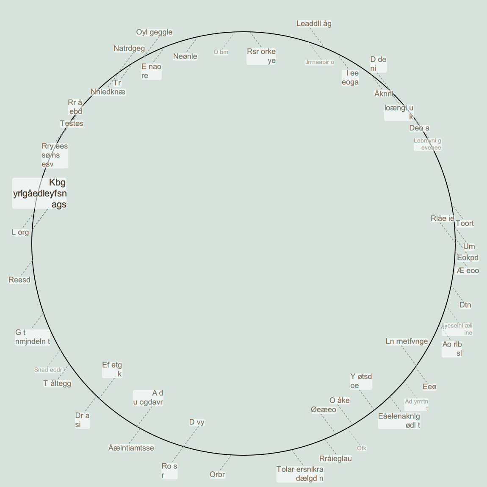
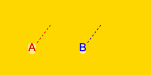

# LuxorLabels
An add-on to [Luxor.jl](https://github.com/JuliaGraphics/Luxor.jl), this aids with [placing labels](https://en.wikipedia.org/wiki/Automatic_label_placement) automatically for readability. Selective labels display is useful for geographical maps and other diagrams.

The image shows labels pointing at random points on a circle, and with random priority. Some labels are hidden, because of priority and overlapping other labels' text or their anchor point. The default label plotting function was used.




# Description

## Hello world example
```
begin
       Drawing(300, 150, "firsttry.svg")
       background("gold")
       label_all_at_given_offset(txt = ["A", "B"],
           x = [100, 200], y = 50,                              # Both labels get y = 50
           shadowcolor = Luxor.parse(Colorant, "Gold4"),        # Too fancy?
           textcolor = Luxor.parse.(Colorant, ["red", "blue"]))
       finish()
       end
```





The user interface functions all take the same list of keyword arguments. They convey 'what to do' in the function names, and use keywords to define the label content.

## User interface terms

  - `prioritized` means: Drop labels that can't be plotted without overlapping other labels.
     The function returns information about which (if any) were dropped.
  - `all` means: Plot all labels
  - `at given offset`: Don't try to find the best offset direction.
  - `optimize diagonal offset`: If labels overlap, flip offset diagonally (a 2-satisfiability problem). Often the best choice since leader lines remain parallel.
  - `optimize vertical offset`: If  labels overlap, flip  vertically.
  - `optimize horizontal offset`: Good for placing labels around a vertical line.
  - `optimize offset`: Text offset to any quadrant. A 4-satisfiability problem, slow, and often produces less readable output since leader lines (if enabled) are not parallel.
  - `bounding boxes`: Don't actually plot, just return the boxes where text would go.


## User interface functions

- `label_prioritized_at_given_offset`
- `label_prioritized_optimize_vertical_offset`
- `label_prioritized_optimize_horizontal_offset`
- `label_prioritized_optimize_diagonal_offset`
- `bounding_boxes_all_at_given_offset`
- `label_prioritized_optimize_offset`
- `label_all_at_given_offset`
- `label_all_optimize_vertical_offset`
- `label_all_optimize_horizontal_offset`
- `label_all_optimize_diagonal_offset`
- `label_all_optimize_offset`


## Tweak how labels look using keywords

Keywords are used to generate labels data. See inline docs for `LabelPaperSpace`.
Most keywords are similar to Luxor / Cairo's `text` functionality. 

The `prominence`property affects how labels are prioritized, and their font size. 
`prominence = 1.0` is used for the most important labels. When labels are dropped
because of overlap, these are the last to be dropped.

You can also specify your own label plotting function, for example by tweaking `plot_label_bounding_box`.  To be useful with this package, it should output a bounding box as
well as graphics.

## Other examples

See the test folder for examples.

Example of a ruler, with priority given to 0, 10, 20, 30:


Example of a box, where prominence is given to 0, 10, 20, 30. 2nd priority is given to 5, 15 etc.:


Example of a default label in all four (default) offset positions. Keyword `plot_guides` is set to `true`.


## References

The label placement optimization uses [JuMP.jl](https://github.com/jump-dev/JuMP.jl) with a solver from GNU project [GLPK.jl](https://github.com/jump-dev/GLPK.jl).

You also need to use [Luxor.jl](https://github.com/JuliaGraphics/Luxor.jl).